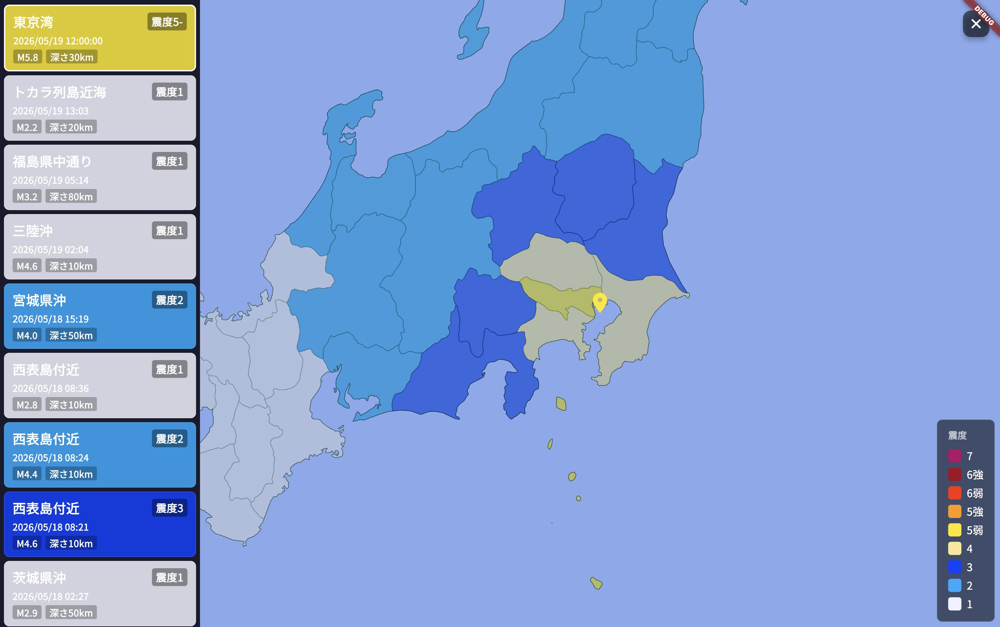

# eq_rp (Earthquake Raspberry Pi)

## プロジェクト概要
本プロジェクトは、地震情報をリアルタイムに取得し表示するためのRaspberry Pi（ラズパイ）向けアプリケーションです。
バックエンドにFastAPI、フロントエンドにFlutterを採用しています。

- **バックエンド (`/api`)**: Python/FastAPIを利用して構築されています。国立研究開発法人防災科学技術研究所（NIED）の強震モニタ（Kmoni）APIから地震情報を取得します。APIへのリクエスト負荷を軽減するため、地震発生時は自動的に「地震モード（10分間）」に移行し、適切なキャッシュ制御を行いつつ最新データをクライアントに提供します。ローカル起動のみを想定しています。
- **フロントエンド (`/app`)**: Flutterを利用して構築されています。バックエンドから取得した地震情報（EEW等）を日本地図上にマッピングし、視覚的に分かりやすく表示します。状態管理にはRiverpodを使用しています。

## データソース
本アプリケーションは、以下の外部データソースを利用して地震情報を取得しています。

- **強震モニタ (Kyoshin Monitor)**
  - **提供元**: [国立研究開発法人 防災科学技術研究所 (NIED)](https://www.bosai.go.jp/)
  - **API Endpoint (EEW)**: `http://www.kmoni.bosai.go.jp/webservice/hypo/eew/`
  - **概要**: 日本全国の強震観測網（K-NET, KiK-net）のデータをリアルタイムに提供するサービスです。本プロジェクトでは緊急地震速報（EEW）の情報を取得し、各都道府県の震度などの表示に活用しています。

- **気象庁 防災情報JSON / 履歴用CSV**
  - **提供元**: [気象庁 (JMA)](https://www.jma.go.jp/)
  - **API Endpoint**: `https://www.jma.go.jp/bosai/quake/data/list.json`
  - **フォールバック**: `api/data/hist.csv` (ローカル保存の履歴CSV)
  - **概要**: 過去の地震履歴（History）の初期データを取得するために気象庁のAPIを利用しています。API通信に失敗した場合は、フォールバックとしてローカルに保存されている `hist.csv` を読み込んで履歴データを構築します。

## 主要な利用パッケージ (OSS / pub.dev)

Flutterアプリケーション(`/app`)では、以下の主要なパッケージを利用しています。

### 状態管理・アーキテクチャ
- **[riverpod_annotation](https://pub.dev/packages/riverpod_annotation) / [hooks_riverpod](https://pub.dev/packages/hooks_riverpod)**
  - 予測可能で安全な状態管理と依存性の注入（DI）のために利用。
- **[flutter_hooks](https://pub.dev/packages/flutter_hooks)**
  - ウィジェットのライフサイクルやローカルな状態（コントローラーなど）を簡潔に管理するために利用。

### モデル生成・シリアライズ
- **[freezed_annotation](https://pub.dev/packages/freezed_annotation) / [freezed](https://pub.dev/packages/freezed)**
  - イミュータブルなデータクラスの自動生成と、パターンマッチング等の機能拡張のために利用。
- **[json_annotation](https://pub.dev/packages/json_annotation) / [json_serializable](https://pub.dev/packages/json_serializable)**
  - APIから取得するJSONデータのシリアライズ・デシリアライズ処理の自動生成に利用。

### 通信関連
- **[http](https://pub.dev/packages/http)**
  - FastAPIバックエンドとのHTTP通信に利用。
- **[web_socket_channel](https://pub.dev/packages/web_socket_channel)**
  - リアルタイムでのデータストリーミング（WebSocket通信）に利用。

### ルーティング・UI
- **[go_router](https://pub.dev/packages/go_router)**
  - アプリ内の画面遷移を宣言的に定義・管理するために利用。
- **[japan_maps](https://pub.dev/packages/japan_maps)**
  - 取得した地震情報に基づいて、日本地図上の都道府県ごとに色分け表示（震度別の可視化など）を行うために利用。
- **[cupertino_icons](https://pub.dev/packages/cupertino_icons)**
  - アプリ内でiOSスタイルのアイコンを利用するために組み込み。

## 利用ライブラリ (Python)

FastAPIバックエンド（`/api`）では、以下の主要なライブラリを利用しています。

- **[FastAPI](https://fastapi.tiangolo.com/)**
  - 高パフォーマンスなAPIサーバーの構築に利用。
- **[httpx](https://www.python-httpx.org/)**
  - 強震モニタや気象庁APIなどの外部サービスとの非同期・同期通信に利用。
- **[pydantic](https://docs.pydantic.dev/)**
  - データバリデーションと設定管理（FastAPIのコアとして動作）。
- **[gpiozero](https://gpiozero.readthedocs.io/)**
  - Raspberry PiのGPIOピン制御（パッシブブザー操作）に利用。
- **[smbus2](https://pypi.org/project/smbus2/)**
  - I2C経由のLCD1602ディスプレイ制御に利用。
- **[lgpio](https://pypi.org/project/lgpio/)**
  - gpiozeroのバックエンドとしてRaspberry Pi上のGPIO操作に利用。

## アプリケーションアーキテクチャ構成

各コンポーネントは役割ごとに明確に分離されています。

### バックエンド (FastAPI)
関心事の分離（Separation of Concerns）を目的として、以下のようなレイヤードアーキテクチャを採用しています。

- **`main.py`**: アプリケーションのエントリーポイント（Raspberry Pi実機用）。LCD表示ループ・ブザーアラートをバックグラウンドタスクとして起動します。
- **`main_demo.py`**: デモ用エントリーポイント。起動から10秒後にダミーのEEWデータ（東京湾 震度5弱）を自動注入し、LCD・ブザーの動作を実機なしで確認できます。
- **`LCD1602.py`**: I2C接続のLCD1602ディスプレイ制御モジュール。地震検知時に「EARTHQUAKE!」と最大震度、待機時に「STANDBY」を表示します。
- **`buzzer.py`**: パッシブブザー（GPIO 17番ピン）の単体動作確認スクリプト。NHK風チャイム音列を再生します。
- **`src/routes/`**: エンドポイントの定義（ルーティング）。
- **`src/services/`**: ビジネスロジック。キャッシュ制御やデータの加工を担当。
- **`src/repository/`**: データアクセス層。外部APIやローカルCSVとの通信を担当。
- **`src/schemas/`**: データモデルの定義。
- **`src/intensity/`**: 震度計算などのドメインロジック。

### フロントエンド (Flutter)
Riverpodを用いたモダンなLayered Architectureを採用しています。

- **`lib/main.dart`**: アプリの起動およびグローバルな設定。
- **`lib/ui/`**: 表示層（Screens/Widgets）。`go_router`による遷移管理と、`japan_maps`による地図表示を行います。
- **`lib/provider/`**: 状態管理・ロジック層。`Riverpod`を使用してAPI通信やアプリの状態を管理し、UIに提供します。
- **`lib/model/`**: データモデル層。`Freezed`を用いてイミュータブルなデータ構造を定義します。
- **`lib/util/`**: 共通ユーティリティ。震度別の色変換（Intensity Color Builder）やフォント設定などを担当します。

## 起動方法

### バックエンド (FastAPI) — 実機用
```bash
cd api
fastapi dev main.py
```
> **Note:** プロジェクトルールに従い、FastAPIはローカル起動のみを想定しています。

### バックエンド (FastAPI) — デモモード（実機なし確認用）
```bash
cd api
fastapi dev main_demo.py
```
起動から約10秒後にダミーEEWデータが注入され、LCD・ブザーの動作をシミュレートします。

### フロントエンド (Flutter)
```bash
cd app
flutter pub get
flutter run
```

## スクリーンショット
通常時


地震発生時

